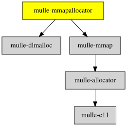

# mulle-mmapallocator

#### 🌍 mulle-mmapallocator a mulle-allocator that shared memory

mulle-mmapallocator can be used to create memory allocations shared across
process boundaries. Due to cross-platform considerations, the memory to be
shared with the other processes must be pre-allocated at initialization time.

mulle-mmapallocator can also be used to create a separate allocation
space, which can then easily be reclaimed by destroying the allocator.


| Release Version                                       | Release Notes  | AI Documentation
|-------------------------------------------------------|----------------|---------------
|  [](//github.com/mulle-core/mulle-mmapallocator/actions) | [RELEASENOTES](RELEASENOTES.md) | [DeepWiki for mulle-mmapallocator](https://deepwiki.com/mulle-core/mulle-mmapallocator)


## Documentation & Guides

* [API Summary](asset/dox/api/toc)


### You are here




## Add

mulle-mmapallocator is a component of the [mulle-core](//github.com/mulle-core/mulle-core) library. So in your code include the mulle-core umbrella header:

``` c
#include <mulle-core/mulle-core.h>
```

### Add mulle-core to a cmake and git project

``` bash
git submodule add https://github.com/mulle-core/mulle-core.git mulle-core
```

Add this to your `CMakeLists.txt`:

``` cmake
add_subdirectory( mulle-core)
target_link_libraries( ${PROJECT_NAME} PRIVATE mulle-core)
```


### Add mulle-core to a mulle-sde project

``` sh
mulle-sde add github:mulle-core/mulle-core
```

### Embed mulle-mmapallocator with clib

``` sh
clib install --out src mulle-core/mulle-mmapallocator
```

Append `src` to your include path (e.g. add `-isystem src`  to your `CFLAGS`)
and compile all the sources that were downloaded.

## Install

Use [mulle-sde](//github.com/mulle-sde) to build and install mulle-mmapallocator and all dependencies:

``` sh
mulle-sde install --prefix /usr/local \
   https://github.com/mulle-core/mulle-mmapallocator/archive/latest.tar.gz
```

### Legacy Installation

Install the requirements:

| Requirements                                 | Description
|----------------------------------------------|-----------------------
| [mulle-mmap](https://github.com/mulle-core/mulle-mmap)             | 🇧🇿 Memory mapped file access
| [mulle-allocator](https://github.com/mulle-c/mulle-allocator)             | 🔄 Flexible C memory allocation scheme

Download the latest [tar](https://github.com/mulle-core/mulle-mmapallocator/archive/refs/tags/latest.tar.gz) or [zip](https://github.com/mulle-core/mulle-mmapallocator/archive/refs/tags/latest.zip) archive and unpack it.

Install **mulle-mmapallocator** into `/usr/local` with [cmake](https://cmake.org):

``` sh
PREFIX_DIR="/usr/local"
cmake -B build                               \
      -DMULLE_SDK_PATH="${PREFIX_DIR}"       \
      -DCMAKE_INSTALL_PREFIX="${PREFIX_DIR}" \
      -DCMAKE_PREFIX_PATH="${PREFIX_DIR}"    \
      -DCMAKE_BUILD_TYPE=Release &&
cmake --build build --config Release &&
cmake --install build --config Release
```


## Author

[Nat!](https://mulle-kybernetik.com/weblog) for Mulle kybernetiK  


